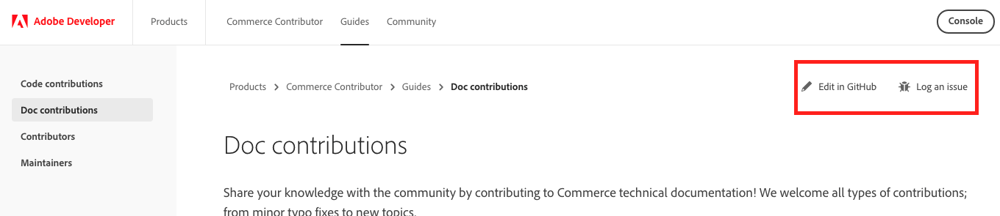

# Doc contributions

Share your knowledge with the community by contributing to Commerce technical documentation! We welcome all types of contributions; from minor typo fixes to new topics.

You can contribute by creating an issue or pull request (PR) in one of our many GitHub repositories. Just click one of the following buttons at the top of any documentation page:

Adobe staff members and [community maintainers](../maintainers/) review issues and pull requests on a regular basis. We do our best to address all issues as soon as possible, but working through the backlog takes time. We appreciate your patience.

<InlineAlert variant="help" slots="text"/>

For more information about contributing to doc projects, see the [contribution guidelines](https://github.com/magento/devdocs/blob/master/.github/CONTRIBUTING.md).
