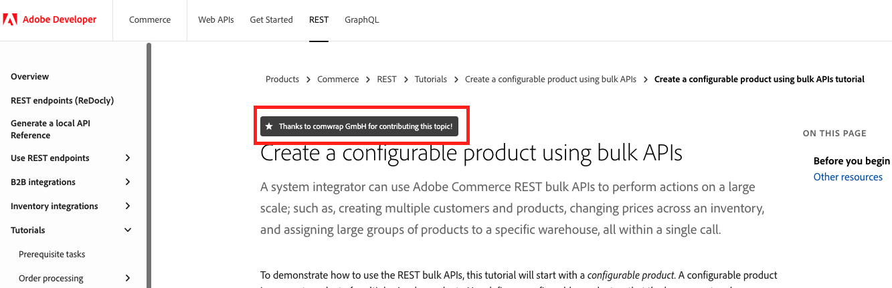
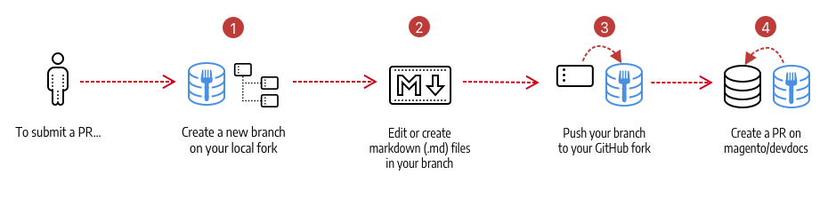

# Doc contributions

Share your knowledge with the community by contributing to Commerce technical documentation! We welcome all types of contributions; from minor typo fixes to new topics.

You can contribute by creating an issue or pull request (PR) in one of our GitHub repositories. Click one of the following buttons at the top of any documentation page:


Adobe staff members and [community maintainers](../maintainers/) review issues and pull requests on a regular basis. We do our best to address all issues as soon as possible, but working through the backlog takes time. We appreciate your patience.

## Contributor attribution

If you write and contribute a new topic, we will add your name (or your company's name) at the top of the page and link it to your GitHub profile (or company website)! For example:



## Get started


1. Make sure you have a [GitHub account](https://github.com/signup/free).
1. Fork the [AdobeDocs](https://github.com/topics/adobe-commerce-devsite) repository that you want to contribute to. Remember to [sync your fork](https://help.github.com/articles/syncing-a-fork/) and update branches as needed.
1. Review the [contribution guidelines](#contribution-guidelines).

<InlineAlert variant="info" slots="text" />

If you use a fork instead of a branch, please set permissions to allow maintainers to edit and update the PR. See [Allowing changes to a pull request branch created from a fork](https://docs.github.com/en/github/collaborating-with-issues-and-pull-requests/allowing-changes-to-a-pull-request-branch-created-from-a-fork) in the _GitHub documentation_.

## Contribute documentation

The following diagram shows the contribution workflow:



### Project boards

All issues and PRs are automatically added to the following GitHub project boards"

- [Commerce - Issues](https://github.com/orgs/AdobeDocs/projects/6/views/1)—If you are not sure where to start contributing, search for issues with the `help wanted` and `good first issue` labels. These issues receive higher priority for processing.
- [Commerce - Pull Requests](https://github.com/orgs/AdobeDocs/projects/5/views/1)—Track the progress of all PRs.

### Create a branch

1. Create a new branch from your fork using a name that best describes the work or references a GitHub issue number.
1. Edit or create markdown (`.md`) files in your branch.
1. Push your branch to your fork.

### Create a pull request

1. Create a pull request to the target AdobeDocs repository.

   In general, you should use `main` as the base branch when creating a PR. If your contribution is related to a release that is in progress, use a version-specific integration branch, such as `develop`.

1. Complete the pull request template.

    **We will close your pull request if you do not complete the template.**

1. After creating a pull request, an Adobe staff member or maintainer will review it and may ask you to make revisions.

    **We will close your pull request if you do not respond to feedback in two weeks.**

<InlineAlert variant="info" slots="text" />

If you have not signed the [Adobe Contributor License Agreement](https://opensource.adobe.com/cla.html), the pull request provides a link. You must sign the CLA before we can accept your contribution.

## Contribution guidelines

The following guidelines may answer most of your questions and help you get started:

-  Write content using Markdown.
-  Review existing [pull requests](https://github.com/orgs/AdobeDocs/projects/5/views/1) and [issues](https://github.com/orgs/AdobeDocs/projects/6/views/1) to avoid duplicating work.
-  For large contributions, or changes that include multiple files, [open an issue](#report-an-issue) and discuss it with us first. This helps prevent duplicate or unnecessary work.
-  Do not make global find-and-replace changes without first creating an issue and discussing it with us. Global changes can have unintended consequences.
-  Combine multiple small changes (such as minor editorial and technical changes) into a single pull request. This helps us efficiently and effectively facilitate your contribution.
-  Familiarize yourself with the organization and conventions of our existing documentation before creating a pull request. Changes that are consistent with our style and conventions have a higher acceptance rate.

   -  If you need to update the site navigation, ask for help in Slack ([#devdocs](https://magentocommeng.slack.com/messages/CAN932A3H)).

-  Review your work for basic typos, formatting errors, or ambiguous sentences before opening a pull request.
-  Revise pull requests according to review feedback. We will close pull requests that require an inordinate amount of time to review and process (especially for minor changes) if you fail to make revisions according to review feedback.
-  Do not directly contact Adobe team members or maintainers on Slack to review your pull request unless it has been open for more than five days. We have a process and queue for pull requests that everyone must follow.
-  Get recognized on the Adobe web site for writing new topics! Add your name and a link to your company website or GitHub profile to the file metadata so that we can display it on the page. See [Edit metadata](#edit-metadata).
-  We no longer recognize individual community members who contribute features to the Magento 2 codebase in the corresponding feature topic(s) in the documentation. Adobe recognizes these contributions in more appropriate channels (for example, the [Magento DevBlog](https://community.magento.com/t5/Magento-DevBlog/bg-p/devblog)).

## Tips for writing content

Use the following guidelines to help you with the writing process:

-  Focus your efforts on providing useful information for your fellow Adobe Commerce and Magento Open Source developers and community members. For example, consider providing or revising code samples, important notes, and clarifying vague or ambiguous content.
-  Define the goal of your topic. What exactly do you want to teach the reader?
-  Make the title of your topic reflect the content.
-  Keep your sentences concise. Separate conceptual information from procedural steps.
-  Batch several small changes into a single pull request (instead of separate ones) to ensure your contributions are approved and merged quickly. Have several typo fixes across several areas of documentation? Combine them into a single PR.
-  Remember to write in present tense, use the second person, and use active voice (not passive). For example, _"The log captures commands, output..."_.
-  Use notes to alert readers about important details.
-  Use cross-references to other topics sparingly. We can help you with the syntax if it is not clear. The template provides an example you can use.

### Review changes locally

_(Optional)_ To review your changes in HTML output, follow the instructions in the repo's README to build the site locally using Gatsby.

### Edit metadata

The Markdown (.md) file's metadata is a set of YAML key-value pairs. The metadata section is located at the top of each file.

```yaml
---
title:
description:
contributor_name:
contributor_link:
---
```

> Key-value pair reference:

| Property  | Description | Required? |
| ------------- | ---------- | ---------- |
| `title`       | Sets the title of the page in the HTML metadata and the main title on the page. Max character limit is 60. | Yes |
| `description` | Sets the description of the page in the HTML metadata. Max character limit is 160. | Yes |
| `contributor_name` | Sets the name of the contributor who wrote the topic and displays it on the page. | No |
| `contributor_link` | Creates a link to the contributor's GitHub profile or company website. | No |

## Report an issue

If you find a typo or errors in the documentation, you can either fix it with a pull request (as described above) or you can report it by creating an issue in the corresponding GitHub repository.

You must complete the issue template. We will close your issue if you fail to complete the template. Enter as much information as you can, including content corrections, steps to reproduce, command or code updates, or questions for clarifications.

<InlineAlert variant="info" slots="text" />

Check the existing [issues](https://github.com/orgs/AdobeDocs/projects/6/views/1) on GitHub to see if someone has already reported the issue.

You can provide feedback using the following options:

-  Have general feedback? Create an issue in the corresponding [AdobeDocs GitHub repo](https://github.com/topics/adobe-commerce-devsite).
-  Have feedback on a specific page? Click the **Edit in GitHub** link at the top right of the page to report on the currently open topic.
-  Have a Community code contribution that needs documentation? Create an issue in the corresponding [AdobeDocs GitHub repo](https://github.com/topics/adobe-commerce-devsite).

## Contact DevDocs

Have a question? Need help? Adobe staff, Maintainers, and other Contributors are available through:

-  [Slack](https://magentocommeng.slack.com/archives/CAN932A3H) ([Join us](https://opensource.magento.com/slack))
-  [Twitter @AdobeCommrcDocs](https://twitter.com/AdobeCommrcDocs)

Thank you for contributing to the documentation!
