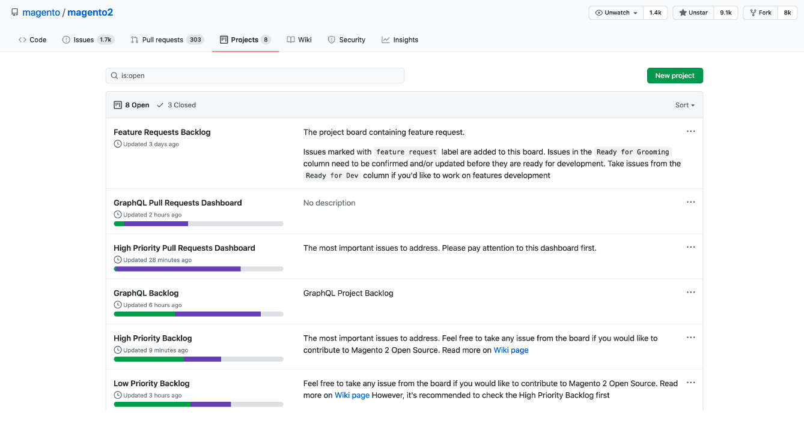
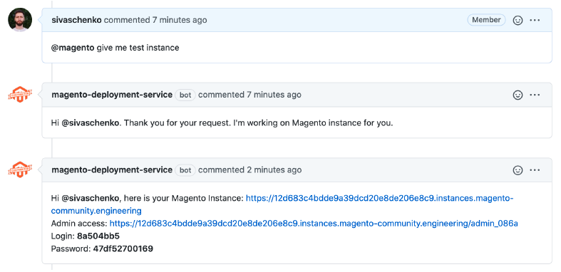

# Maintainers handbook

This document describes activities performed by a community maintainer, provides some insight and description of the tools integrated within GitHub to assist our maintainers.

## Repositories and projects

Our maintainers work on numerous repositories within the Magento Github organization. The repository that has most activity is [magento2](https://github.com/magento/magento2). Depending on your interest, you might also interact with some of our other repositories, such as:

-  [pwa-studio](https://developer.adobe.com/commerce/pwa-studio/)
-  [magento2-phpstorm-plugin](https://github.com/magento/magento2-phpstorm-plugin)
-  [inventory](https://github.com/magento/inventory)
-  [adobe-stock-integration](https://github.com/magento/adobe-stock-integration)
-  and [many others](https://github.com/magento)

Because most contributions go to the [magento2](https://github.com/magento/magento2) repository, there are several GitHub projects to help manage these contributions.

Each project has a description of what it does. One important project is the **High Priority pull request Dashboard**, where you can find the pull requests (PR) that will bring most value for the community and will be delivered first.

## Pull request dashboard

Within projects there are pull request dashboards. There you will find our Kanban board, which has columns representing the PR delivery workflow. The columns title are self-explanatory and should represent the action required for the pull requests on that column.

## Pull request review process

The first step in the review process is to choose and self-assign a pull request from the dashboard. To help maintainers choose a PR to review, there are several labels, the most important being **Priority**. We encourage our maintainers to choose pull requests with the highest priority from the **High Priority pull request Dashboard** in the **Pending Review** column.

Once you have chosen a pull request, there are some steps to be followed during the review process.

### Check CLA and builds

The first thing we encourage a maintainer to check is if the contributor has signed the Adobe CLA. Without this signature, we cannot accept the contribution. If the Contributor has not signed the CLA, that check will be red. Add a comment to the pull request requesting the contributor to sign the CLA.

Once the CLA has been signed, we can check the other builds. Those builds are run based on the contributors pull request and will let us know if the proposed changes are causing existing functionality to break or are not fully compliant with coding standards. If either the Heath Index or Semantic Version Checker fail, the PR should be changed or the proposed changes will need approval by the Adobe team. More information can be found on our [Contributor Guide](../code-contributions/pull-request-tests.md).

### Check the pull request target

It is important to check the pull request is targeted to the correct branch. For example, if the contributor’s PR does not create backwards incompatible changes, these changes should be targeted at the current minor release branch. If the PR introduces backwards incompatible changes, or it is part of a different project, it must target the correct branch.

### Code review

The code review is one of the most important parts of the review process. Our community maintainers are responsible for reviewing the proposed changes and confirm they are following the [Technical Guidelines](https://developer.adobe.com/commerce/php/coding-standards/technical-guidelines/). It is important to evaluate if the proposed changes are backward compatible and follow the rules and best practice of our [Backward Compatible Development Guide](../code-contributions/backward-compatibility-policy.md). We count on our Maintainers judgement for other recommendations to increase contribution quality.

### Test coverage

As described on our [Definition of Done](../code-contributions/definition-of-done.md), all code changes must be covered by automated tests. It is part of the review process to:

-  Guarantee the changes are properly covered
-  Ensure the type of test used to cover the changes is appropriate
-  Add the appropriate label to the pull request

If the pull request is not covered by tests, the maintainer should advise the contributor on how to add proper test coverage.

### Approve changes

Once all the steps above are complete, the maintainer can approve the contributor’s PR. After approving the PR, it will proceed through the delivery process and will be tested to guarantee quality.

## Other useful information

Besides the repositories, projects and code review process, there are other tools and processes that maintainers should know about.

### Related pull requests

Magento Open source is a complex platform and, some changes may require changes in multiple repositories. For example, if a contributor’s PR performs a change on a feature that is being used on the Adobe Commerce edition, it may require a parallel PR in that repository.

In that case, builds need to run using the changes from both PRs. To do so, use the 'related pull requests' feature. This feature is enabled by adding the link to the related pull request on the main pull request description using Github keywords. Details on this are in the [Contributor Guide](../code-contributions/pull-request-tests.md#related-pull-requests).

### Pull request deployment tool

The deployment tool helps contributors and maintainers to test changes or validate if an issue exists on a clean installation. More information on the deployment tool can be found in the [Contributor's Guide](../code-contributions/index.md#contributor-assistant).

### Maintainers Slack channel

We communicate with our community maintainers on our Slack channel. Once you are on-boarded as a maintainer, we will add you to this channel. You can discuss contributions and share your ideas or information with other maintainers.

### Regular meetings

Currently, we have two meetings that we encourage our maintainers to attend and engage with the Community Engineering team:

-  Maintainer’s Call – Once a month.
-  [Community Contributions Triage](https://github.com/magento/magento2/wiki/Public-Triage-Meeting) – Scheduled twice a week.
